<div align="center">




**Panduan lengkap menjalankan Linux (Ubuntu, Debian, Fedora, Kali, Arch, Alpine) di Android dengan Termux + proot-distro, tanpa root.**


</div>

> [!NOTE]
> Panduan ini sudah disesuaikan dengan **proot-distro versi 5.x** (2026), yang mengunduh distro dari **image Docker Hub**. Banyak tutorial lama di internet masih memakai perintah versi 4 yang sudah tidak berlaku.

---

## 📋 Daftar Isi

1. [🧠 Pengenalan](#-pengenalan)
2. [📌 Prasyarat](#-prasyarat)
3. [📲 Instal Termux](#-instal-termux)
4. [⚙️ Instal proot-distro](#️-instal-proot-distro)
5. [🐧 Instal Distro](#-instal-distro)
6. [🔑 Masuk ke Distro](#-masuk-ke-distro)
7. [📦 Kelola Paket](#-kelola-paket)
8. [👤 Membuat User Non-Root](#-membuat-user-non-root)
9. [🖥️ Tampilan Desktop (GUI)](#️-tampilan-desktop-gui)
10. [🧰 Manajemen Distro](#-manajemen-distro)
11. [📖 Contekan Perintah](#-contekan-perintah)
12. [🔧 Troubleshooting](#-troubleshooting)
13. [💡 Tips & Trik](#-tips--trik)

---

## 🧠 Pengenalan

**Termux** adalah aplikasi terminal untuk Android. Dengan Termux kamu bisa menjalankan perintah Linux, menginstal paket, dan menulis skrip tanpa perlu me-root HP.

**proot-distro** adalah alat untuk memasang distribusi Linux lengkap di dalam Termux. Cara kerjanya memakai `proot`, sehingga distro berjalan di "wadah" (container) terpisah, juga **tanpa root**.

```
Android  ➜  Termux  ➜  proot-distro  ➜  Ubuntu / Debian / Fedora / ...
```

> [!TIP]
> `pd` adalah singkatan dari `proot-distro`. Jadi `pd login ubuntu` sama dengan `proot-distro login ubuntu`.

---

## 📌 Prasyarat

- 📱 Android **7.0** ke atas (disarankan Android 9+)
- 💾 Ruang kosong minimal **2 GB** (lebih banyak jika memasang GUI)
- 🌐 Koneksi internet stabil
- 🧠 RAM 3 GB+ disarankan agar lancar

---

## 📲 Instal Termux

> [!WARNING]
> **Jangan** instal Termux dari Google Play Store. Versi di sana sudah usang dan banyak paket yang gagal diunduh.

1. Unduh Termux dari **[F-Droid](https://f-droid.org/packages/com.termux/)** atau **[GitHub Releases](https://github.com/termux/termux-app/releases)**.
2. Buka Termux, lalu berikan akses penyimpanan:

```bash
termux-setup-storage
```

3. Perbarui semua paket:

```bash
pkg update && pkg upgrade -y
```

---

## ⚙️ Instal proot-distro

```bash
pkg install proot-distro -y
```

`proot` ikut terpasang otomatis. Cek versi yang terpasang:

```bash
pkg show proot-distro
```

---

## 🐧 Instal Distro

Format perintahnya:

```bash
pd install <image> [--name <nama>]
```

`<image>` adalah nama image di Docker Hub. Opsi `--name` dipakai untuk memberi nama pendek pada distro.

### 🔎 Mencari distro

```bash
pd search ubuntu
```

### 📱 Distro yang bisa dipasang di HP

| Distro | Perintah |
|:--|:--|
| 🟠 Ubuntu | `pd install ubuntu` |
| 🔴 Debian | `pd install debian` |
| 🔵 Fedora | `pd install fedora` |
| 🏔️ Alpine | `pd install alpine` |
| 🐉 Kali | `pd install kalilinux/kali-rolling --name kali` |
| 🎯 Arch | `pd install menci/archlinuxarm --name archlinux` |

<details>
<summary><b>❓ Kenapa Kali & Arch perintahnya beda?</b></summary>
<br>

- **Kali Linux** tidak punya image bernama `kali`. Image resminya adalah `kalilinux/kali-rolling`.
- **Arch Linux** resmi (`archlinux`) hanya tersedia untuk PC (amd64), jadi **gagal di HP** yang memakai prosesor ARM. Gunakan image komunitas `menci/archlinuxarm` yang mendukung ARM.

Opsi `--name` membuat namanya pendek, sehingga kamu cukup mengetik `pd login kali` atau `pd login archlinux`.

</details>

<details>
<summary><b>📌 Memasang versi tertentu</b></summary>
<br>

Tambahkan tag versi setelah tanda `:`

```bash
pd install ubuntu:24.04
pd install debian:12 --name debian12
```

Tanpa tag, versi terbaru (`latest`) yang dipakai.

</details>

> [!NOTE]
> Ukuran unduhan berbeda-beda. Alpine sekitar 4 MB, sedangkan Ubuntu atau Fedora puluhan MB. Lama proses tergantung kecepatan internet.

---

## 🔑 Masuk ke Distro

```bash
pd login ubuntu
```

Prompt akan berubah menjadi:

```
root@localhost:~#
```

Artinya kamu sudah berada di dalam Ubuntu 🎉. Ketik `exit` untuk kembali ke Termux.

<details>
<summary><b>⚡ Menjalankan satu perintah tanpa masuk</b></summary>
<br>

```bash
pd login ubuntu -- uname -a
```

</details>

---

## 📦 Kelola Paket

Setelah login, perbarui paket dengan perintah sesuai distro:

**🟠 Ubuntu / Debian / Kali**
```bash
apt update && apt upgrade -y
apt install nano
```

**🔵 Fedora**
```bash
dnf upgrade -y
dnf install nano
```

**🎯 Arch**
```bash
pacman -Syu
pacman -S nano
```

**🏔️ Alpine**
```bash
apk update && apk upgrade
apk add nano
```

> [!TIP]
> Image Docker sangat minimalis, jadi alat seperti `nano`, `sudo`, `curl`, dan `git` mungkin belum ada. Pasang sesuai kebutuhan.

---

## 👤 Membuat User Non-Root

Secara bawaan kamu login sebagai `root`. Untuk keamanan, buat user biasa (contoh untuk Ubuntu/Debian):

```bash
apt update && apt install sudo -y
useradd -m -s /bin/bash budi
passwd budi
usermod -aG sudo budi
exit
```

Lalu login sebagai user tersebut dari Termux:

```bash
pd login ubuntu --user budi
```

Sekarang perintah admin dijalankan dengan `sudo`, contoh `sudo apt update`.

---

## 🖥️ Tampilan Desktop (GUI)

Kamu bisa menjalankan desktop **XFCE** dan membukanya lewat aplikasi **VNC Viewer**.

<details>
<summary><b>📖 Langkah-langkah (Ubuntu/Debian)</b></summary>
<br>

**1. Pasang XFCE dan server VNC** (di dalam distro):

```bash
apt update
apt install xfce4 xfce4-terminal dbus-x11 tigervnc-standalone-server -y
```

**2. Jalankan server VNC**, lalu buat password saat diminta:

```bash
vncserver :1 -xstartup startxfce4
```

**3. Buka aplikasi VNC Viewer** di HP (unduh dari Play Store), lalu sambungkan ke:

```
localhost:5901
```

**4. Mematikan server VNC:**

```bash
vncserver -kill :1
```

</details>

> [!WARNING]
> GUI membutuhkan ruang sekitar **1–2 GB** dan RAM yang cukup. Di HP dengan RAM kecil, tampilan bisa terasa lambat.

---

## 🧰 Manajemen Distro

| Aksi | Perintah |
|:--|:--|
| 📋 Lihat distro terpasang | `pd list` |
| 💾 Backup | `pd backup ubuntu --output ubuntu.tar.gz` |
| ♻️ Restore | `pd restore ubuntu.tar.gz` |
| 🔄 Reset ke awal | `pd reset ubuntu` |
| ✏️ Ganti nama | `pd rename ubuntu ubuntu-lama` |
| 🗑️ Hapus | `pd remove ubuntu` |
| 🧹 Hapus cache unduhan | `pd clear-cache` |

> [!CAUTION]
> `pd reset` dan `pd remove` **menghapus semua data** di dalam distro. Lakukan backup terlebih dahulu.

<details>
<summary><b>💡 Simpan backup ke penyimpanan HP</b></summary>
<br>

Agar file backup bisa dilihat di File Manager:

```bash
pd backup ubuntu --output ~/storage/downloads/ubuntu.tar.gz
```

File akan muncul di folder **Download**. (Pastikan sudah menjalankan `termux-setup-storage`.)

</details>

---

## 📖 Contekan Perintah

```bash
pkg install proot-distro       # instal proot-distro
pd search <nama>               # cari image distro
pd install <image>             # pasang distro
pd list                        # daftar distro terpasang
pd login <distro>              # masuk ke distro
pd login <distro> --user <u>   # masuk sebagai user
pd backup <distro> -o f.tar.gz # backup
pd restore f.tar.gz            # restore
pd reset <distro>              # pasang ulang dari awal
pd remove <distro>             # hapus distro
pd <perintah> --help           # bantuan perintah
```

---

## 🔧 Troubleshooting

<details>
<summary><b>❌ Paket Termux gagal diunduh / repository error</b></summary>
<br>

Pastikan Termux berasal dari **F-Droid/GitHub**, bukan Play Store. Lalu ganti mirror dan perbarui:

```bash
termux-change-repo
pkg update
```

</details>

<details>
<summary><b>❌ <code>pd install archlinux</code> atau <code>pd install kali</code> gagal</b></summary>
<br>

Lihat bagian [Instal Distro](#-instal-distro). Gunakan:

```bash
pd install menci/archlinuxarm --name archlinux
pd install kalilinux/kali-rolling --name kali
```

</details>

<details>
<summary><b>❌ Unduhan distro gagal / terputus</b></summary>
<br>

Biasanya karena koneksi. Hapus cache lalu ulangi:

```bash
pd clear-cache
pd install ubuntu
```

</details>

<details>
<summary><b>❌ <code>sudo: command not found</code></b></summary>
<br>

Kamu sudah login sebagai root, jadi sebenarnya tidak perlu `sudo`. Jika tetap ingin memasangnya:

```bash
apt install sudo -y
```

</details>

<details>
<summary><b>❌ Termux tidak bisa mengakses penyimpanan</b></summary>
<br>

```bash
termux-setup-storage
```

Jika masih gagal, buka **Pengaturan → Aplikasi → Termux → Izin**, lalu aktifkan izin penyimpanan.

</details>

<details>
<summary><b>🐢 Distro terasa lambat / Termux tertutup sendiri</b></summary>
<br>

- Tutup aplikasi lain yang berjalan di latar belakang.
- Matikan **optimasi baterai** untuk Termux.
- Di Android 12+, sistem bisa menghentikan proses berat ("phantom process killer"). Kurangi beban, misalnya hindari GUI di HP ber-RAM kecil.
- `proot` memang lebih lambat dari Linux asli karena berjalan tanpa root.

</details>

---

## 💡 Tips & Trik

- ⌨️ Pasang **tmux** di dalam distro untuk membuka banyak terminal sekaligus.
- 🚀 Buat alias di Termux agar lebih cepat, contoh: `echo "alias ubuntu='pd login ubuntu'" >> ~/.bashrc`
- 📂 Folder Termux bisa diakses dari dalam distro, jadi berbagi file jadi mudah.
- 💾 Rutin **backup** sebelum bereksperimen.
- ❓ Semua perintah punya bantuan: `pd install --help`

---

## 📚 Referensi

- [Dokumentasi resmi proot-distro](https://github.com/termux/proot-distro)
- [Wiki Termux](https://wiki.termux.com)

## 🤝 Kontribusi

Menemukan kesalahan atau ingin menambahkan materi? Silakan buat **Issue** atau **Pull Request**. Semua kontribusi sangat dihargai 🙏

## 📄 Lisensi

Dirilis di bawah lisensi **MIT**. Bebas digunakan, dimodifikasi, dan dibagikan.

---

<div align="center">

Dibuat dengan 💜 oleh [**AXRYZURE**](https://github.com/superrrkyy) • 🇮🇩

⭐ Beri bintang jika panduan ini membantu!

</div>
